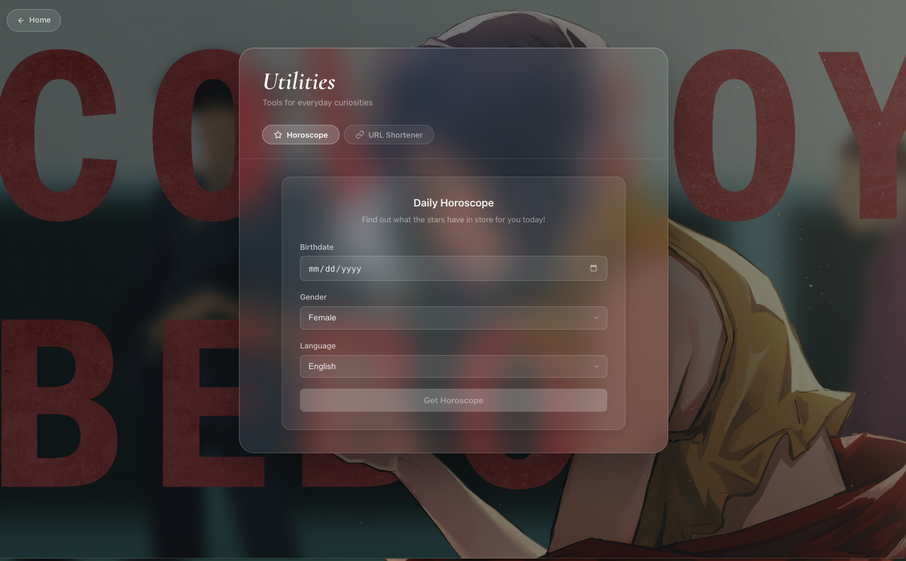
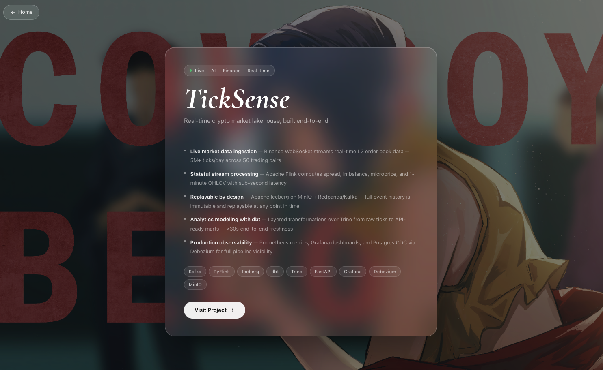

# Portfolio Website of Andrew Chen 

v0.1.0 

* Homepage

* Utilities

* Projects 

### Memo 

In current stage of refactoring, when building backend Docker images, need to follow these steps:
1. Redirect to `/backend`
2. Run build command with the full path of the Dockerfile

    `docker build -f services/history/Dockerfile -t history_test:0.0.3 .`

If we can put all shared files in all services (config.py, logger.py...), we can bypass this step. 
However, this violates "DRY" principle.

I didn't find a better solution yet, so will stick with method for now.

### Roadmap
- [x] New feature: Project (TickSense.ai) (May 21, 2026)
- [x] Refactor frontend for better aesthetic (May 21, 2026)
- [x] New feature: Horoscope
- [x] Frontend: Support URL Shortener functionality 
- [x] Deploy on AWS Elastic Lightsail
- [ ] Integrate GitHub Actions and workflow (TBD)
- [x] Utilities and other functionalities
- [x] Backend backbone: uses FastAPI and Python (Expected: Nov 5, 2024)
- [x] Retrieve articles from Medium (https://andrewact.medium.com/) 
- [x] Frontend (raw): uses Angular and TypeScript (Expected: Nov 6, 2024)
- [x] Domain name service (andrewcee.io) (Expected: Nov 7, 2024)

