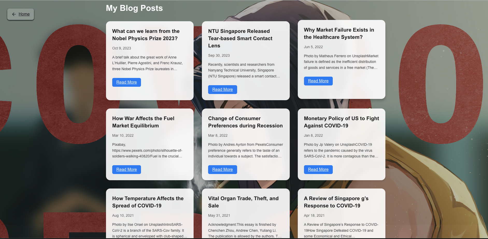
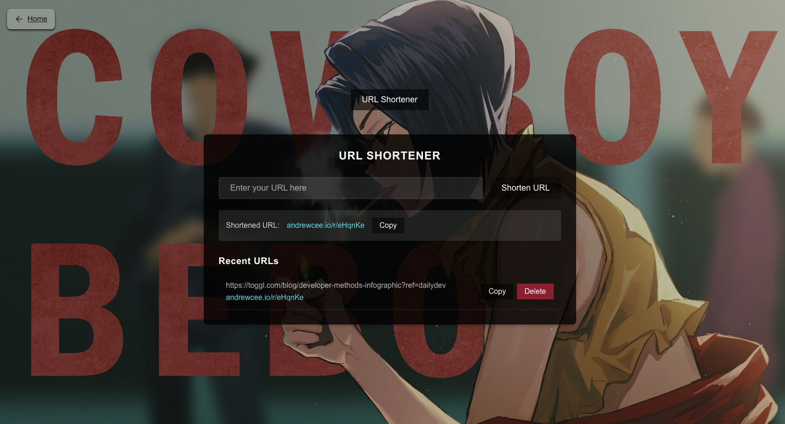

# Portfolio Website of Andrew Chen 

v0.0.1 

* Homepage

* Medium Articles 

* URL Shortener

### Roadmap
- [ ] Frontend: Support URL Shortener functionality (Expected: Nov 7, 2024)
- [ ] Deploy on AWS Elastic Beanstalk (TBD) 
- [ ] Integrate GitHub Actions and workflow (TBD)
- [ ] Utilities and other functionalities
- [x] Backend backbone: uses FastAPI and Python (Expected: Nov 5, 2024)
- [x] Retrieve articles from Medium (https://andrewact.medium.com/) 
- [x] Frontend (raw): uses Angular and TypeScript (Expected: Nov 6, 2024)
- [x] Domain name service (andrewcee.io) (Expected: Nov 7, 2024)